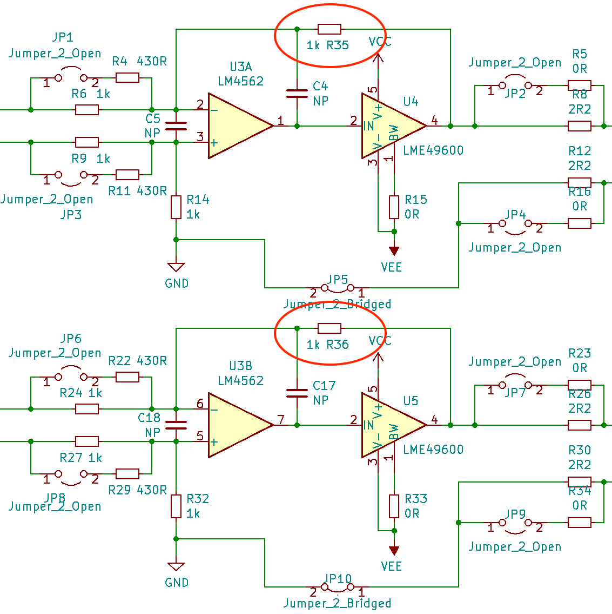
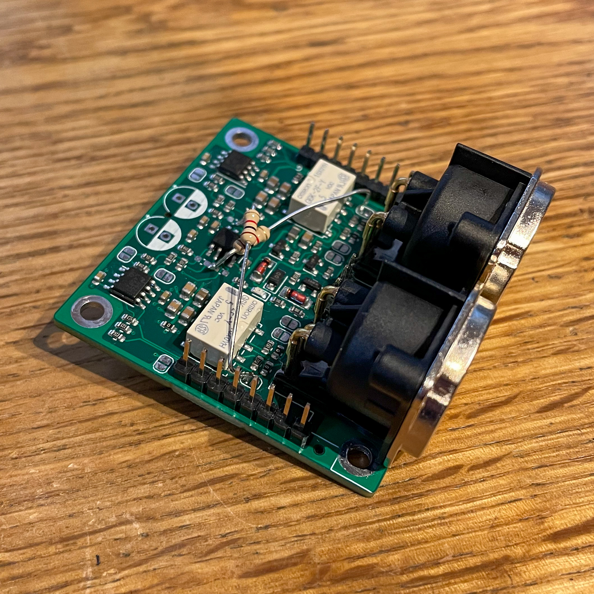

Mixer-W-Output-HP
===

This repository is part of the USB audio mixer project described on https://www.twam.info/general/building-a-custom-usb-audio-mixer.

The 'W-Output HP' board is an W-Output compatible head phone amplifier, which can be used on
[W-DAC 4493](https://nihtila.com/2020/02/27/w-dac-4493-very-high-performance-compact-dac/) or
[W-DAC S 4493](https://nihtila.com/2020/12/28/w-dac-s-4493/). It is based on the
[HP Buf](https://nihtila.com/2018/02/04/hp-buf-high-current-buffered-amplifier-board-for-hp-mobo/) by
[Tomi Nihtilä](https://nihtila.com).

### Revision 1

Revision 1 misses two feedback resistors (R35, R36 in latest schematic):

Those can be easily bodged in with two through hole resistors:

### JLCPCB

PCBs can be ordered almost fully-assembled from [JLCPCB](https://jlcpcb.com/DDE). Required files are
[W-Output HP_cpl_jlc.csv](Gerber/W-Output%20HP_cpl_jlc.csv), [W-Output HP_bom_jlc.csv](Gerber/W-Output%20HP_bom_jlc.csv) and
[W-Output HP.zip](Gerber/W-Output%20HP.zip). Components missing are
* Two LME49600 on the buttom side of the board (U4, U5)
* Two 100uF electrolytic capacitors (C8, C21)
* Two NC3MBH-1 connectors (J4, J5)
* Two pin headers/pin sockets.

## License

[![CC BY-SA 4.0][cc-by-sa-shield]][cc-by-sa]

This work is licensed under a [Creative Commons Attribution-NonCommercial-ShareAlike 4.0 International License][cc-by-sa].

[![CC BY-SA 4.0][cc-by-sa-image]][cc-by-sa]

[cc-by-sa]: http://creativecommons.org/licenses/by-nc-sa/4.0/
[cc-by-sa-image]: https://licensebuttons.net/l/by-nc-sa/4.0/88x31.png
[cc-by-sa-shield]: https://img.shields.io/badge/License-CC%20BY--NC--SA%204.0-lightgrey.svg
